<picture>
  <source media="(prefers-color-scheme: dark)" srcset="./assets/bridge-dark.svg">
  <source media="(prefers-color-scheme: light)" srcset="./assets/bridge-light.svg">
  
</picture>

<picture>
  <source media="(prefers-color-scheme: dark)" srcset="./assets/captain-dark.svg">
  <source media="(prefers-color-scheme: light)" srcset="./assets/captain-light.svg">
  
</picture>

<picture>
  <source media="(prefers-color-scheme: dark)" srcset="./assets/engine-dark.svg">
  <source media="(prefers-color-scheme: light)" srcset="./assets/engine-light.svg">
  
</picture>

<a href="https://github.com/nenikolaidis?tab=repositories">
<picture>
  <source media="(prefers-color-scheme: dark)" srcset="./assets/fleet-dark.svg">
  <source media="(prefers-color-scheme: light)" srcset="./assets/fleet-light.svg">
  
</picture>
</a>

<!-- live:start -->
`▶ live` <a href="https://digital-airlines-web.onrender.com/">digital-airlines-api</a> · <a href="https://devflow-board-11146.web.app/demo/">devflow</a>
<!-- live:end -->

<picture>
  <source media="(prefers-color-scheme: dark)" srcset="./assets/sonar-dark.svg">
  <source media="(prefers-color-scheme: light)" srcset="./assets/sonar-light.svg">
  
</picture>

`> charted by` <a href="./generate.py">generate.py</a> · regenerated daily by <a href="./.github/workflows/update.yml">an Action</a> · <a href="./LICENSE.md">MIT</a>

